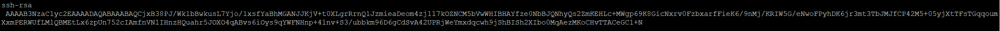

## Primero, vamos a verificar y configurar SSH en el switch. 
Ejecuta estos comandos:
``` bash
configure
crypto key generate ssh
ip ssh
ip ssh filetransfer
write memory
```


## Verifica que SSH esté activo:
``` bash
show ip ssh
```

## Configura el acceso REST:
``` sh
configure
rest-interface
write memory
```

## Extrae el token ssh del equipo switch, router, ap o firewall
``` bash
    show crypto host-public-key
```
Algo asi es que te saldria
***
AAAAB3NzaC1yc2EAAAADAQABAAABAQCjxB38PJ/WklbBwkusL7Yjo/1xsfYaBhMGANJJKjV+t0XLgrRrnQ1JzmieaDeom4zj117kOZNCM5bVwWHIBHAYfze0NbBJQNhyQs2ZmKEHLc+MWgp69K8GicNxrv0FzbxarfFieK6/9nMj/KRIW5G/eNwoFPyhDK6jr3mt3TbJMJfCP42M5+05yjXtTFsTGqqoum
XxmPERWUfLMlQBMEtLx6zpUn752cIAmfnVN1IHnzHQuahr5JOXO4qABvs6iOys9qYWFNHnp+4lnv+S3/ubbkm96D6gCdSvA42UPRjWeYmxdqcwh9jShBISh2XIbo0MqAezMKoCHvTTACeGC1+N
***


## En tu computadora/servidor de gestión, necesitas instalar Ansible:

### Para Linux (Ubuntu/Debian):
``` bash
sudo apt update
sudo apt install ansible
```
### Para RHEL/CentOS:
``` bash
sudo yum install ansible
```

## Instala la colección de Aruba para Ansible:

``` bash
ansible-galaxy collection install arubanetworks.aoscx
``` 
## Crea un directorio para tu proyecto:

``` bash
mkdir aruba-ansible
cd aruba-ansible
```

## Crea un archivo inventory.yml:

``` bash
echo "---
all:
  hosts:
    aruba_switch:
      ansible_host: TU-IP-DEL-SWITCH
      ansible_network_os: arubanetworks.aoscx.aoscx
      ansible_connection: network_cli
      ansible_user: TU-USUARIO
      ansible_password: TU-PASSWORD" > inventory.yml
```
## Crea un playbook de prueba (test.yml):

``` bash
echo "---
- name: Test Aruba Connection
  hosts: aruba_switch
  gather_facts: no
  
  tasks:
    - name: Get system information
      arubanetworks.aoscx.aoscx_command:
        commands:
          - show version
          - show running-config" > test.yml
```
## Prueba la conexión:

``` bash
ansible-playbook -i inventory.yml test.yml
```