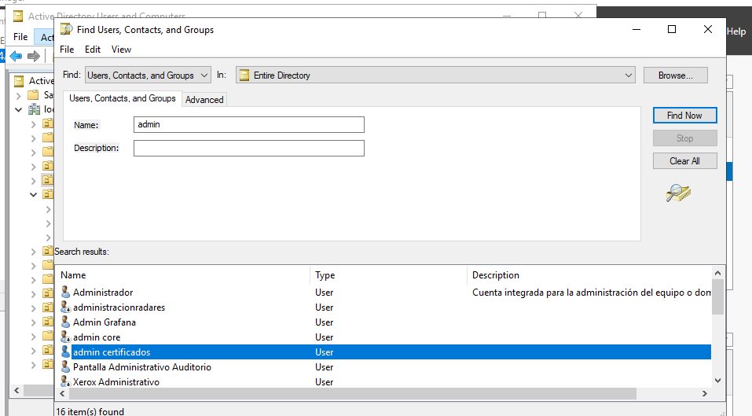

# * Resetear o recordar el pasword del admin del zimbra

- [ ] revisar la clave del admin del webmail

  

  En caso de no recordar hay que cambiar el password del admin de los certificados en el active directory y luego conectarse al https://172.20.1.99 una vez cambiado el password.

Prueba con ansible

2. revisar en el caso del mail el snapshot
3. 88.10   serviciosssl
   88.6    pagina web
   1.34   dinardap
   1.30   erp
   1.32   via web este es el waf
   1.249  calidad del aire
   1.99   hay que revisarle especial Zimbra
   secundarios
   glpi   1.88
   nextcloude  1.28
   alfresco 1.51
